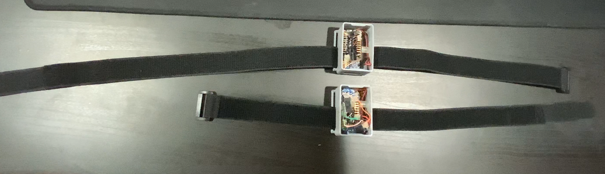

# Andi_V-Projects

## Wearable Motion Tracking to Prevent Injury

 

Description

 
This is how you dropdown.

Software

 
This is how you dropdown.

Hardware

 
This is how you dropdown.

## Gas Alert

 

Description

 
This is how you dropdown.

Software

 
This is how you dropdown.

Hardware

 
This is how you dropdown.

## Smart Night Stand Lamp

 

Description

 
This is how you dropdown.

Software

 
This is how you dropdown.

Hardware

 
This is how you dropdown.

