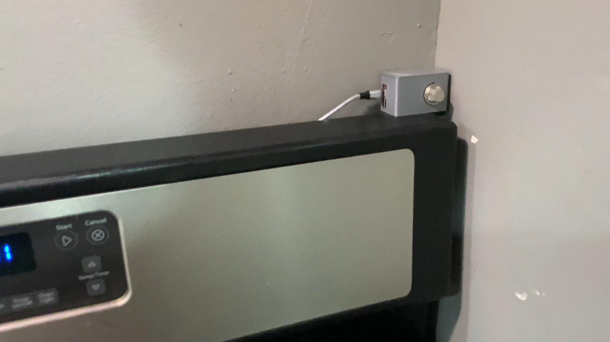
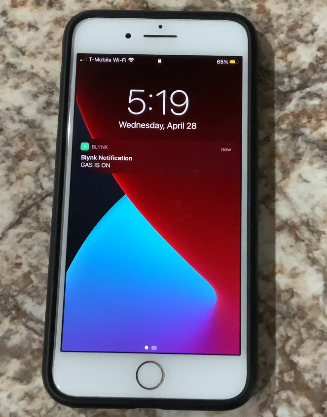

# Andi_V-Projects

## To-Done
Recent project done using React JS for the front-end and Firebase to serve as a backend for authentication and database.

 

 

## Wearable Motion Tracking to Prevent Injury

 

Based on a research paper, my team and I built wearable modules consisting of an IMU (MPU 6050) and an ESP-32 (microcontroller) that sent precise motion data over Bluetooth in the form of quaternions in real time (40 Samples/s). 
  
To utilize this Data, we built a user interface in Java (Processing) that allowed the user to view, record, and visualize this data with a 3D wireframe skeleton.
 

## Gas Alert

 

A smart home device that uses a natural gas sensor and an ESP-32 (microcontroller) to alert a user on a smartphone that there is a gas leak present.

The notification system is facilitated through an internet-based API (BLYNK) which allows Gas Alert to notify the user anywhere there is an internet connection available.

## Smart Night Stand Lamp

 

A reprogrammable nightstand lamp that is built upon the open sourced WLED repository giving it IoT capabilities and modified by me to also be controlled through an Ultra Sonic sensor that allows a hand wave to turn the lamp on and off.

The lamp has a power design that allows one USB type-c port to facilitate the power needs of the lamp, as well as fast charge a smart phone and a laptop simultaneously.

